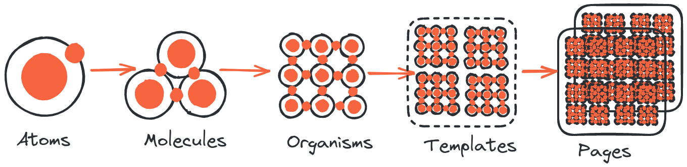

# WEBKOTH UI

WEBKOTH UI - это библиотека веб-интерфейса, предоставляющая широкий набор готовых компонентов для разработки фронтенда. Она основана на Tailwind CSS и включает в себя компоненты, разработанные для:

- Native HTML
- Blade-шаблонов для Laravel 

#### В разработке:
- Vue.js
- React.js

### Методология: [Atomic Design](https://atomicdesign.bradfrost.com/)
### Дизайн компонентов вдохновлен: [Practical and Refactoring UI](https://www.refactoringui.com/)
### Архитектура: [Feature-Sliced Design](https://feature-sliced.design/) 

## Кратко о методологии

1. **Интерфейс как система:** Автор подчеркивает важность рассмотрения интерфейса как системы, а не просто как отдельных страниц или компонентов. Atomic Design предлагает подход, который помогает организовать компоненты в повторно используемые и масштабируемые блоки, формируя единую систему.

2. **Атомы, молекулы, организмы, шаблоны, страницы:** Методология Atomic Design предлагает пять уровней компонентов, начиная от самых маленьких "атомов" (например, кнопки) и объединяя их в более крупные "молекулы", "организмы", "шаблоны" и, наконец, "страницы". Эти уровни предоставляют ясную структуру для создания и поддержки интерфейса.

3. **Философия модульности:** Atomic Design нацелен на создание модульных и "переиспользуемых" компонентов. Разделение интерфейса на более мелкие части облегчает их использование в различных контекстах и проектах, что способствует поддержке и масштабированию дизайна.

4. **Инструменты и термины:** Автор представляет несколько терминов и инструментов, таких как "Атомы" (простые элементы), "Молекулы" (группы атомов), "Организмы" (группы молекул и атомов), "Шаблоны" (группы организмов, молекул и атомов) и "Страницы" (конечные продукты).

5. **Работа над проектом:** В ресурсе также предоставляется обзор методов работы над проектом, основанных на Atomic Design. Это включает в себя этапы разработки, такие как создание элементов, их компонентов, формирование страниц и т. д.

## Атомарный дизайн

Атомарный дизайн представляет собой иерархическую систему элементов интерфейса, основанную на принципах симметрии и комбинаторики. Разделение на следующие уровни помогает организовать элементы интерфейса:

### Атомы
Атомы представляют собой самые мелкие элементы интерфейса, такие как кнопки, поля ввода и текст.

### Молекулы
Молекулы - это комбинации атомов, образующие более сложные элементы, такие как формы и меню.

### Компоненты
Компоненты - это молекулы, которые могут быть повторно использованы в различных контекстах.

### Системы
Системы представляют собой наборы компонентов, образующих целостный интерфейс.

Атомарный дизайн обеспечивает легкость масштабирования и адаптации интерфейса к различным устройствам и размерам экрана. Это достигается за счет универсальности атомов и молекул, которые могут быть использованы в различных контекстах.

Этот подход также делает интерфейсы более гибкими и устойчивыми к изменениям. Благодаря компонентам, легко изменяемым или обновляемым без воздействия на весь интерфейс, достигается высокая адаптивность и поддерживаемость.

### Простыми словами:

1. "Атомы" (простые элементы)
2. "Молекулы" (группы атомов)
3. "Организмы" (группы молекул и атомов)
4. "Шаблоны" (группы организмов, молекул и атомов)
5. "Страницы" (конечные продукты).

## Содержание

1. [Установка](#установка)
2. [Использование](#использование)
3. [Возможности](#возможности)
4. [Участие в разработке](#участие-в-разработке)
5. [Поддержка](#поддержка)
6. [Авторы и благодарности](#авторы-и-благодарности)
7. [Лицензия](#лицензия)
8. [Статус проекта](#статус-проекта)
9. [Планы на будущее](#планы-на-будущее)

## Установка

Чтобы установить WEBKOTH UI, выполните следующие шаги:

1. [Склонировать репозиторий](#)
2. [Установить зависимости](#)
3. [Настроить параметры](#)
4. [Запустить приложение](#)

Дополнительные инструкции по установке можно найти в разделе [Установка](#).

## Использование

Изучите примеры использования WEBKOTH UI, ознакомившись с документацией в разделе [Использование](#).

## Возможности

- Компоненты на базе Native HTML
- Blade-шаблоны для интеграции с Laravel
- Компоненты Vue.js и React.js
- Возможная интеграция с Bootstrap
- Основано на стеке TALL

## Участие в разработке

Мы приветствуем ваши вклады! Если вы хотите внести свой вклад в развитие WEBKOTH UI, прочтите [Руководство по участию в разработке](#) для получения дополнительной информации.

## Поддержка

Если у вас возникли вопросы или вам нужна помощь, посетите наш [Исследователь проблем](#) или присоединитесь к нашему сообществу в [Чат-комнате](#).

## Авторы и благодарности

Мы хотели бы выразить благодарность всем участникам, которые помогли сделать WEBKOTH UI возможным.

## Лицензия

WEBKOTH UI - это программное обеспечение с открытым исходным кодом, лицензированное на условиях [MIT License](#).

## Статус проекта

В настоящее время активно ведется разработка WEBKOTH UI.

## Планы на будущее

В планах на будущее включены следующие возможности:

- Поддержка Bootstrap

Дополнительные детали можно найти в разделе [Планы на будущее](#).
